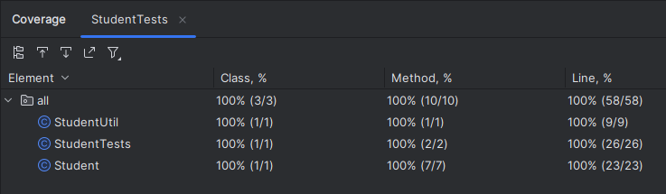

# Lab 2

## Course Information

- **Course:** CSC 203
- **Instructor:** Professor Vanessa Rivera
- **Term:** 2023-24 Spring Quarter

## Overview

In this second lab assignment, you will develop a basic class that is intended to be instantiated.
In doing so, you will practice implementing a constructor, instance variables, encapsulation of data, and a basic instance method.

Later, you will implement a static version of an instance method to demonstrate how static and non-static methods can be interchanged.

Finally, you will practice writing unit tests to verify the functionality of a class.

## Learning Objectives

In completing this assessment, you will be able to:

- Create a UML diagram as a design for a simple class. (🎨)
- Explain the difference between static and non-static methods. (☕)
- Write JUnit tests for both a static and non-static method. (🛠️)

## Background

### Unit Testing in Java

JUnit is a standard third-party module used for unit testing in Java.
In JUnit, test cases are represented by methods prefixed by the `@Test` *annotation*.
Each test method typically tests a single aspect of a method's behavior.

JUnit provides a set of assertion methods to test expected outcomes.
These include methods like `assertEquals()`, `assertTrue()`, etc.

Below are example unit tests that would reside in a file called `ExampleTests.java`:

```java
import static org.junit.jupiter.api.Assertions.*;
import org.junit.jupiter.api.Test;
import java.util.*;

public class ExampleTests {

    @Test
    public void testMathPow() {
        assertEquals(64.0, Math.pow(4.0, 3.0), 0.01);
        // Note the optional third "tolerance" parameter
    }

    @Test
    public void testListGet() {
        List<Integer> list = new ArrayList<>(List.of(1, 2, 3));
        assertEquals(2, list.get(1));
    }
}
```

> [!Note]
>
> JUnit is not a built-in module.
> However, I have included it for you under the `lib` directory in each assignment that requires tests.
> By default, IntelliJ IDEA will (usually) identify and import it automatically.
> 
> If you encounter any errors with importing JUnit, please let me know.

## Instructions

### Task 1: Create a UML Diagram

**🎯 Task Goal:** Create a UML diagram for a Student class.

1. **Create a Handwritten UML Diagram a Student Class:** For this task, create a UML diagram ***using pencil and paper***.
   The intent is for you to practice in the format that will be given during exams.
2. **Guidelines:** The diagram should include all the following:
   - A `private` string "name" instance variable.
   - A `private` decimal number "grade" instance variable.
   - A public getter method for the student's name.
   - A public getter method for the student's grade.
   - A public *instance* method called `getLetterGrade()` that accepts no parameters and returns a single character.
   - An override for the `toString()` method.
   - An override for the `equals()` method. 
   - An override for the `hashCode()` method.
   - Note: For all parameter and return values be sure to use the appropriate data types as described in class.
3. **Details:** Follow standard UML style, including access modifiers and types.
4. **Submission:** Submit a photo of your UML diagram to Canvas alongside your submission.

### Task 2: Implement the Student Class

**🎯 Task Goal:** Complete the Student class in `src/Student.java`.

1. Write Code for the "Student" Class: Define and implement the methods in `src/Student.java` to match your Task 1 UML diagram.
2. **Requirements:** The methods should meet the following requirements:
   - **Constructor:** The class should have a single constructor that accepts a name and grade value (in that order) for the student object.
   - **"getLetterGrade":** This method should return the student's letter grade, using the grade instance variable, as a character using the table provided in _our class syllabus_.
     For example, the following code would print the text `C`:
     ```java
        Student student = new Student("Pearl", 79.9999999);
        System.out.println(student.getLetterGrade());
     ```
   - **"toString":** This method should return a string in the following format:
     ```
     NAME (GRADE) 
     ```
     Where "NAME" and "GRADE" are replaced with the instance's `name` and `grade` instance variable values, respectively.
     Round the grade value to two decimal places.
     For example the following code would print the text `Harvest (90.00)`:
     ```java
        Student student = new Student("Harvest", 89.995);
        System.out.println(student);
     ```
   - **"equals":** This method should return `true` if a Student object is compared to an equivalent `Student` object, and `false` otherwise.
     Follow the logic discussed in class, lecture slides, and the course example code.
   - **"hashCode":** This method should return a unique integer based on both instance variables.
     Follow the logic discussed in class, lecture slides, and the course example code.
3. **Submission:** Commit and push your code changes to GitHub for submission.

### Task 3: Write a Static Method

🎯 Task Goal: Write a static `getLetterGrade` method.

1. **Write a Static Method:** In `src/StudentUtil.java` write a public static method named getLetterGrade.
2. **Requirements:** This method should accept a Student object as a parameter and return the student's letter grade, using the student's grade instance variable, as a Java string using the table provided in our class syllabus.
   For example, the following code would print out the text `A`:
   ```java
   Student student = new Student("Mochi", 102.0);
   System.out.println(StudentUtil.getLetterGrade(student));
   ```
   You must use the Student class's getter to implement this method independently of `Student.getLetterGrade`.
   That is, **do not call the `Student.getLetterGrade` instance method in your static implementation**.
3. **Submission:** Commit and push your code changes to GitHub for submission.

### Task 4: Write Unit Tests

**🎯 Task Goal:** Write unit tests for both getLetterGrade methods.

- **Write JUnit Tests:** In `src/StudentTests.java` write unit tests for all methods in your `Student` class and `StudentUtil.getLetterGrade`.
  -  **Testing "hashCode":** You are recommended to use an expression involving `Double.hashCode()` in your assertion statement for the `hashCode` method.
- **Requirements:** You should write enough tests to achieve 100% line coverage in both `Student` and `StudentUtil`.
  - **Coverage:** See the "Resources" section for information on running your code with coverage using IntelliJ IDEA.
- **Submission:** Include a screenshot of your 100% line coverage in IntelliJ IDEA in your Canvas submission.



## Resources

- [The Java Tutorials: Classes and Objects](https://docs.oracle.com/javase/tutorial/java/javaOO/index.html): An official tutorial that describes the basics of classes and objects in Java.
- [junit.org: User Guide (Writing Tests)](https://junit.org/junit5/docs/current/user-guide/#writing-tests): An official example for writing JUnit tests.
- [IntelliJ IDEA: Code Coverage](https://www.jetbrains.com/help/idea/code-coverage.html): A tutorial for running programs with code coverage in IntelliJ IDEA.

## Submission

For completion of this assignment, please complete the following:

1. Commit and push your updated code to your version of this assignment's GitHub repository.
    - **Note:** Your UML and test coverage will be graded manually.
      The GitHub checkmark does not indicate a grade of 100% on this assignment.
2. In a submission to this assignment's Canvas page, include the following:
   1. A screenshot of your repository on GitHub.com, including your repository name, number of commits, and checkmark.
   2. A photo of your UML diagram.
   3. A screenshot of your unit testing 100% line coverage.

> [!WARNING]
>
> It is your responsibility to ensure proper submission of all assignment components according to the assignment instructions before the due date.
>
> Improperly submitted lab assignments will receive a grade of zero.
>
> You are encouraged to verify submission with your instructor if you are ever unsure.

## Academic Integrity

> [!Warning]
>
> Submitting this assignment confirms that you did not use solutions or code from external, AI-generated, or peer sources.
>
> You also agree to have your code checked by standard plagiarism detection software.
>
> Violation will result in a grade penalty, a report to the University, and further potential action.
>
> Please contact me or see our course syllabus for clarification or further details.

## Due Date

Please refer to Canvas for due-date information, if applicable.

## Grading

Please refer to Canvas for additional grading information, if applicable.
