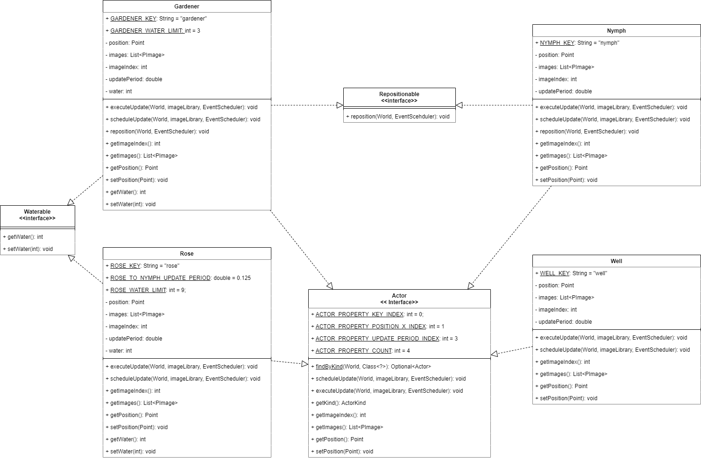

# Lab 3

## Course Information

- **Course:** CSC 203
- **Instructor:** Professor Vanessa Rivera
- **Term:** 2023-24 Spring Quarter

## Overview

This lab assignment is a preview of a larger upcoming project. 

The provided program is a small simulated world with several different "actors" that interact with one another.
The world is supported by multiple interacting classes that help model and display the world.

In this lab, you will refactor, or restructure, the `Actor` class using Java interfaces.

## Learning Objectives

In completing this assessment, you will be able to:

- Understand a large, non-trivial code base. (🛠️)
- Refactor a code base using UML as a guide. (🎨)
- Define and implement several Java interfaces. (🤝)
- Use typecasting to differentiate Java instances. (🧬)

## Instructions

### Task 1: Understand the "Little World"

**🎯 Task Goal:** Run and understand `src/LittleWorld.java`.

1. **Run "LittleWorld":** Run `src/LittleWorld.main()` and examine the program's execution.
2. **Read Accompanying Documentation:** Read both `class_descriptions.md` and `actor_descriptions.md` to get a brief overview of program components.
3. **Examine the Code:** Look at all the classes in the `src` directory, taking special care to understand `Actor.Java`.
   Try to understand how the classes interact using the documentation as a guide before moving on to the next task.

### Task 2: Refactor the "Actor" Class

**🎯 Task Goal:** Implement the interface hierarchy for the `Actor` class according to the UML design.

> [!Note]
> 
> As you complete these tasks, IntelliJ IDEA will temporarily display a multitude of errors.
> 
> This is okay and normal as the code will temporarily be erroneous until completion.
> 
> Careful adherence to instructions is required to achieve the desired end results.
> 
> You are ***strongly*** encouraged to practice this exercise multiple times to become proficient in solving errors that may arise in the process on your own.

**Original UML:** Below is a UML diagram of the given `Actor` class.
It is **not** structured according to object-oriented principles.

**Design Principles:** Many common patterns in OOP have emerged over the years. or best practices called *design principles* have emerged. Adhering to these *design principles*, or best practices, is strongly encouraged as you write object-oriented porgrams.

**Single Responsibility Principle:** This principle states that classes should exist for a singular and well-defined purpose. The given `Actor` class violates this principle: it serves several purposes such as managing behavior for many different "kinds" of entities.

**Refactoring**: You will modify this class to be more object-oriented by *refactoring*, or restructuring its code to utilize interfaces.
Your goal is to create the class hierarchy described by the following UML:

**Instructions:** Carefully complete the following steps to refactor the code base.
These steps are entirely prescriptive, take time to stop yourself at each step in the process to verify your understanding of *why* you are making these changes in the context of the UML diagram.

1. **Convert Actor to an Interface:** Change the `class` keyword to `interface` in `Actor.java`.
2. **Create Classes:** Create empty subtype classes that implement Actor. These are:
   - Gardener
   - Nymph
   - Rose
   - Well
3. **Commit Files to Git:** Ensure all new `.java` files have been added and committed to Git for later submission.
4. **Copy Common Actor Code:** Copy all instance variables and instance methods from `Actor` into the subclasses according to the given UML diagram.
   For example, you would copy `executeUpdate` into every subclass but `water` would only be copied into `Gardener` and `Rose`. 
5. **Move Kind-Specific Code:** Move methods and data specific to each actor into their respective subtypes.
   For example, `updateNymph` and `WELL_KEY` should be moved into your `Nymph` and `Well` classes, respectively.
   - Be sure to also move the "create" methods, e.g., `createGardener` into the respective subclasses.
6. **Clean the Actor Interface:** Remove redundant modifiers (`public`, `static`, and `final`) from relevant methods and variables.
   IntelliJ IDEA will display these modifiers in grey.
   For every instance method, remove any implementation (i.e., their internal code and curly braces).
   Lastly, remove the constructor and instance variables because interfaces can not be instantiated.
   - `findByKind` should remain `static` and have its functionality kept intact.
7. **Create the Class Constructors:** In each subclass, convert the "create" method into a constructor by doing the following:
   - Change the name of the function to the name of the class.
   - Remove the `static` modifier and return type.
   - Assign the class's instance variables to the corresponding values from the original instantiation. For example, in the `Gardener` constructor, `GARDENER_WATER_LIMIT` would be assigned to `water`.
     - You will not use `ActionKind`.
     - `imageIndex` initializes to zero for each actor.
   - Remove the original return statement.
8. **Use Polymorphism with "executeUpdate":** In each subclass, delete `executeUpdate` and then rename each corresponding "update" method (e.g., `updateGardener`) to `executeUpdate`.
   Each method will implement a unique version of `executeUpdate`, forgoing the need for a `switch` statement.
9. **Create and Implement the "Waterable" Interface:** Create a `Waterable` interface as given in the UML diagram.
   The methods should have no implementation.
   In `Gardener` and `Rose`, implement the interface (`implements Actor, Waterable`) by creating a getter and setter for their `water` instance variable.
10. **Create and Implement the "Repositionable" Interface:** Create a `Repositionable` interface as given in the UML diagram.
    The method should have no implementation.
    In `Gardener` and `Nymph`, implement the interface (e.g., `implements Actor, Repositionable` for `Nymph`) by renaming the respective "reposition" method to simply `reposition`.
11. **Fix "Gardener" Errors:** Due to our changes, the `Gardener` class contains various reference errors.
    To fix them, perform the following:
    - `findByKind` only exists in `Actor` as a static method. Change all references of `findByKind` to `Actor.findByKind`.
    - `repositionGardener` was renamed to `reposition`. Change all references of `repositionGardener` to `reposition`. Do this in `Nymph` as well.
    - Some `private` instance variables being accessed by `Gardener` are no longer in the same class. Use public getters variables for these instead (e.g., `position`).
    - The `Actor` class does not have a `water` instance variable, so `rose.getWater()` and `rose.setWater()` won't work.
      Here, you need to **downcast** `target.get()` to a `Rose` before accessing the getter/setter.
12. **Use the Constructors:** When the world is loaded, calls to create instances are performed in `WorldParser.parseActor` to populate the world with actors.
    In this method, modify these calls to use the corresponding class constructors.
    For example, `Actor.createNymph(...)` would be replaced with `new Nymph(...)`.
    Additionally, references to class constants in this method need to be updated, e.g., `Actor.NYMPH_KEY` to `Nymph.NYMPH_KEY`.
    - Note: `Rose.executeUpdate()` must be similarly updated to use the `Nymph` constructor.
13. **Remove "ActorKind" Usage:** Now that we have a class hierarchy in place, we no longer need to differentiate instances by `ActorKind` as we can use Java types instead.
    Perform the following to get rid of any usage of `ActorKind`:
    - Delete the `ActorKind` enumerated type from `Actor`.
    - Delete the `getKind` getter from `Actor`.
    - In `findByKind` replace `ActorKind` with `Class<?>`.
      Next, change the comparison `actorKind == occupant.getKind()` to `actorKind.isInstance(occupant)`, which checks if `occupant` is an instance of the passed in class.
    - Lastly, in `Gardener.reposition()` change references of `ActorKind` values to classes.
      For example, change `ActorKind.ROSE` to `Rose.class`.
14. **Verification:** Run `LittleWorld.java` and ensure that the program behaves as it did initially.
15. **Submission:** Commit and push your code to GitHub, then submit a screenshot to Canvas as evidence of your submission.
    You will likely need to press "commit and push anyway" because of the "TODO" comments.
    For verification, you must commit and push the following files:
    - `Actor.java`
    - `Gardener.java`
    - `Nymph.java`
    - `Repositionable.java`
    - `Rose.java`
    - `Waterable.java`
    - `Well.java`
    - `WorldParser.java`

### Task 3: Reflection Questions

**🎯 Task Goal:** Reflect on your Task 2 completion by answering the following questions.

**Instructions:** Provide each of the following questions and your answer as part of your Canvas submission.

1. Do you think this design is more or less complicated than the original design? Why?
2. Are there any instance variables that are redefined in multiple classes? Why might this be a problem?
3. The `scheduleUpdate` instance method contains the same exact implementation in each implementing class.
   How might this method be optimized?
4. Was the `repositionable` interface necessary? What advantage might its inclusion provide?
5. What was the most challenging part of refactoring to the new design?

## Submission

For completion of this assignment, please complete the following:

1. Commit and push your updated code to your version of this assignment's GitHub repository.
    - **Note:** Your questions will be graded manually.
      The GitHub checkmark does not indicate a grade of 100% on this assignment.
2. In a submission to this assignment's Canvas page, include the following:
    1. A screenshot of your repository on GitHub.com, including your repository name, number of commits, and checkmark.
    2. The Task 3 questions and your answers.

> [!Warning]
>
> It is your responsibility to ensure proper submission of all assignment components according to the assignment instructions before the due date.
>
> Improperly submitted lab assignments will receive a grade of zero.
>
> You are encouraged to verify submission with your instructor if you are ever unsure.

## Academic Integrity

> [!Warning]
>
> Submitting this assignment confirms that you did not use solutions or code from external, AI-generated, or peer sources.
>
> You also agree to have your code checked by standard plagiarism detection software.
>
> Violation will result in a grade penalty, a report to the University, and further potential action.
>
> Please contact me or see our course syllabus for clarification or further details.

## Due Date

Please refer to Canvas for due-date information, if applicable.

## Grading

Please refer to Canvas for additional grading information, if applicable.
