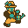
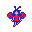
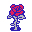

# Actor Descriptions

## Gardener 

- If they have water, they move toward Roses, transferring their water until empty.
- If they are out of water, they move toward a Well to refill it.

## Nymph 

- May potentially move in a random horizontal or vertical direction.

## Rose 

- Begins at zero water level.
- Receives water from a Gardener
- If it has reached its maximum water level, it will become a Nymph.

## Well 

- Gardeners use it to refill their water.
- Otherwise, does nothing.