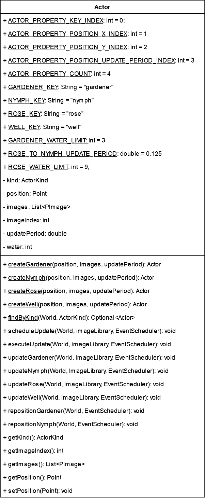

# Lab 4

## Course Information

- **Course:** CSC 203
- **Instructor:** Professor Vanessa Rivera
- **Term:** 2023-24 Spring Quarter

## Overview

This assignment parallels your previous lab assignment.

The provided program is the same, small simulated world with several different "actors" that interact with one another.
The world is supported by multiple interacting classes that help model and display the world.

In this lab, you will refactor, or restructure, the `Actor` class using Java subclasses.

## Learning Objectives

In completing this assessment, you will be able to:

- Understand a large, non-trivial code base. (🛠️)
- Refactor a code base using UML as a guide. (🎨)
- Define and implement several Java parent and child classes. (🧬)
- Define and implement several `abstract` classes. (🧬)
- Use typecasting to differentiate Java instances. (🧬)

## Background

### Creating Subclass Constructors

When creating subclass constructors, you may use the "Create constructor matching super" IntelliJ IDEA feature.


The constructor created by IntelliJ IDEA will need to be modified to match the corresponding "create" method.

For example, this is what IntelliJ IDEA might generate for a `Well` class:

```java
// In the Well class

public Well(ActorKind kind, Point position, List<PImage> images, double updatePeriod, int water) {
    super(kind, position, images, updatePeriod, water);
}
```

There are two issues with this:

1. Eventually, we will get rid of `ActorKind`.
2. The parameters don't match `Actor.createWell`.

Modifying this to match the create method, you should obtain:

```java
// In the Well class

public Well(Point position, List<PImage> images, double updatePeriod) {
    super(ActorKind.WELL, position, images, updatePeriod, 0);
}
```

This will be further modified later when `water` gets pushed down to `WaterActor` and `ActorKind` is removed.

After creating the constructor, you must delete the corresponding "create" method and change references of it to use this new constructor, for example, in `WorldParser.parseActor`.

### Moving Static Members

To move static members to subclasses, perform the following in IntelliJ IDEA:

1. Right-click on the member (variable or method)
2. Select `Refactor > Move Members...`
3. Type in the *destination* class in the field.
4. Ensure the member(s) are highlighted and checked.
5. Confirm the changes.

This will move the member and all references to the specified class.

### Pushing Members Down

This example guides you in "pushing down" the `Actor` class's `updateWell` method to its "Well" subclass.

To use this feature, right-click the member then select `Refactor > Push Members Down...`. 
In many cases, you will receive a warning. Continue pushing down the member *anyway*.
Now there will be an error in `Well` because it is trying to access a private member of the parent.

```java
// In the Well Class

/** Well update logic. */
public void updateWell(World world, ImageLibrary imageLibrary, EventScheduler eventScheduler) {
    imageIndex += 1; // Error
    scheduleUpdate(world, imageLibrary, eventScheduler);
}
```

To fix this, create a public setter for `Actor.imageIndex`, then modify `Well` accordingly.

```java
// In the Actor Class

public void setImageIndex(int imageIndex) {
    this.imageIndex = imageIndex;
}
```

```java
// In the Well Class

/** Well update logic. */
public void updateWell(World world, ImageLibrary imageLibrary, EventScheduler eventScheduler) {
    setImageIndex(getImageIndex() + 1); // Fixed
    scheduleUpdate(world, imageLibrary, eventScheduler);
}
```

For this specific method, one problem will remain because `Actor.executeUpdate` will become abstract.
Again, specifically for the "update" methods, you will convert them to overrides of `Actor.executeUpdate` by renaming them.

```java
// In the Well class

/** Well update logic. */
@Override
public void executeUpdate(World world, ImageLibrary imageLibrary, EventScheduler eventScheduler) {
    setImageIndex(getImageIndex() + 1);
    scheduleUpdate(world, imageLibrary, eventScheduler);
}
```

To get rid of errors as you work on making `Actor` abstract, you can remove the "Well" case from `executeUpdate` before you make it `abstract`:

```java
// In the Actor Class

public void executeUpdate(World world, ImageLibrary imageLibrary, EventScheduler eventScheduler) {
    // TODO: Replace type-dependent switch and/or if statements using overrides.
    switch(kind) {
        case GARDENER:
            updateGardener(world, imageLibrary, eventScheduler);
            break;
        case NYMPH:
            updateNymph(world, imageLibrary, eventScheduler);
            break;
        case ROSE:
            updateRose(world, imageLibrary, eventScheduler);
            break;
        default:
            throw new IllegalArgumentException(String.format("'update' method not implemented for %s", kind));
    }
}
```

It's important to note that when you push a member down, it is **copied to every direct child class**.
In this example, `updateWell` would have been copied into **every subclass** that exists.
To remedy this, simply delete the member from the other classes.

## Instructions

### Task 1: Refactor the "Actor" Class

**🎯 Task Goal:** Refactor the `Actor` class into subclasses.

**Refactoring:** Below is a UML diagram of the given `Actor` class.
It is **not** structured according to object-oriented principles.



You will modify this class to be more object-oriented by refactoring its code to utilize parent-child class inheritance.
Your goal is to create the class hierarchy described by the following UML:


**Instructions:** For each class in the UML diagram, perform the following using Java code:

- Create a **direct** child class of Actor (`Nymph`, `WaterActor`, and `Well`).
- In that class, create a constructor that propagates data:
  - Ensure that the functionality of each original "create" method is matched regarding instance variable assignment (except for `kind`).
  - Change calls to the corresponding "create" method to use this constructor instead.
  - Delete the original "create" methods.
- Move static members.
- Push member(s) down:
  - If using the intelliJ IDEA tools, be sure to delete unnecessary methods and data (e.g., `water` in Nymph, `repositionGardener` in `Well`, etc.) 
  - Create necessary getters/setters in the parent class.
  - If necessary, rename the method as an override and update references to the original name.
- Rename any members (e.g., `reposition`) to match the UML diagram. Use Intellij IDEA's "rename" feature.
- Repeat this process for all classes until all classes match the UML diagram (except for the non-abstract `Actor`).
  Additional guidelines are provided below for the `WaterActor` child class.

**Submission:** When finished, verify that the `LittleWorld` program functions as before.
Commit your changes and new files.

#### Tips for Refactoring "WaterActor"

`WaterActor` is an "intermediate" class between `Actor` and other child classes.
To simplify its refactoring process, you should first push down the "Gardener" and "Rose" methods to `WaterActor`.
Next, push down the methods from `WaterActor` to the corresponding child classes.

In several methods, you will need to type cast from `Actor` to `WaterActor` to access the `water` getter and setters.

When pushing the water variable from `Actor` to `WaterActor`, several changes will need to be made:
1. You will need to remove the `water` parameter in `Actor` and any unrelated constructors (e.g., `Nymph`, `Well`, if they exist).
2. You will need to remove the assignment of the variable in `Actor` and any unrelated constructors.

> [!TIP]
>
> You can right-click a variable and select `Refactor > Encapsulate Fields...` to automatically create a getter and setter.

### Task 2: Convert Actor to Abstract and Clean Up

**🎯 Task Goal:** Convert `Actor` to an `abstract` class and remove the `ActorKind` enumerated type.

1. **Make "Actor" Abstract:** Add the `abstract` keyword to `Actor` and make its `executeUpdate` method `abstract`.
2. **Make "WaterActor" Abstract:** Add the `abstract` keyword to `WaterActor`.
3. **Remove "ActionKind":** Delete the `ActionKind` enumerated type from `Actor` and the `kind` instance variable.
   In each subclass constructor, remove the `ActionKind` parameter.
4. **Update "findByKind":** Change `findByKind` and its calls to use `Class<?>` instead of `ActorKind` exactly as in Lab 3.
5. **Verification:** Run `LittleWorld`.
   All actors should behave as in the original program.
6. **Submission:** Commit and push your code to GitHub.
   You will submit a screenshot as evidence of your submission to Canvas.

### Task 3: Reflection Questions

**🎯 Task Goal:** Answer the following reflection questions about your completion of Task 2.

**Instructions:** Provide each of the following questions and your answer as part of your Canvas submission.

1. Do you think this design is more or less complicated than the original design? Why?
2. Are there any instance variables that are redefined in multiple classes?
3. The "Gardener" and "Nymph" share similar functionality through the "repositionable" method.
   Imagine *more* classes were to be added to the program that could also "reposition".
   How might these separate, similar methods be consolidated into a single, overridden method?
4. What was the most challenging part of refactoring to the new design?
5. How does this design compare to the interface design in Lab 3?

## Submission

For completion of this assignment, please complete the following:

1. Commit and push your updated code to your version of this assignment's GitHub repository.
   - **Note:** Your questions will be graded manually.
     The GitHub checkmark does not indicate a grade of 100% on this assignment.
     **_Your program will be visually inspected to see if it produces the correct "end-state"._**
2. In a submission to this assignment's Canvas page, include the following:
   1. A screenshot of your repository on GitHub.com, including your repository name, number of commits, and checkmark.
   2. The Task 3 questions and your answers.

> [!Warning]
>
> It is your responsibility to ensure proper submission of all assignment components according to the assignment instructions before the due date.
>
> Improperly submitted lab assignments will receive a grade of zero.
>
> You are encouraged to verify submission with your instructor if you are ever unsure.

## Academic Integrity

> [!Warning]
>
> Submitting this assignment confirms that you did not use solutions or code from external, AI-generated, or peer sources.
>
> You also agree to have your code checked by standard plagiarism detection software.
>
> Violation will result in a grade of zero, a report to the University, and further potential action.
>
> Please contact me or see our course syllabus for clarification or further details.

## Due Date

Please refer to Canvas for due-date information, if applicable.

## Grading

Please refer to Canvas for additional grading information, if applicable.
