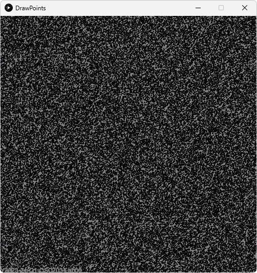

# Lab 5

## Course Information

- **Course:** CSC 203
- **Instructor:** Professor Vanessa Rivera
- **Term:** 2023-24 Spring Quarter

## Overview
This lab explores streams through the implementation of a program to read in a set of numbers (representing points, specifically an image composed primarily of noise).

Through implementing various computational operations on these points they are transformed into a more coherent image (composed of points).

## Learning Objectives

In completing this assessment, you will be able to:

- Initialize a set of stream data. (🔢️)
- Create a pipeline of intermediate and terminal stream operations. (🔢)

## Instructions

The included `positions.txt` file contains x-, y-, and z-coordinate date for a large number of 3-dimensional points.
The `DrawPoints` class will iterate over a list of such points to produce a 2-dimensional image.

You will modify the `DrawPoints` class's `draw()` method to read this point data into `Point` objects, manipulate it using streams, and then convert it to a list.

### Task 1: Read in Points

**🎯 Task Goal:** Parse point objects from a text file.

In `src/DrawPoints.java` under the relevant `TODO` comments, you will modify file handling behavior to parse data from `positions.txt`.
As is, the program opens the file and iterates over each line and stores it as a string using the variable `line`.

You will need to extract the x, y, and z information from the line (this should be done similarly to Project 1).
You should then create a `Point` object using this information and place it in a `List` or `StreamBuilder`.
You must initialize the list/builder outside the loop.

### Task 2: Manipulate Points

**🎯 Task Goal:** Manipulate a collection of point objects using streams.

In `src/DrawPoints.java` under the relevant `TODO` comments, you will create a stream of `Point` objects using your list or stream builder from Problem 1.

After doing so, you will add operations to perform on the stream before conversion with the `Stream.toList()` method.

You must perform the following operations using `map()` and `filter()` methods:
1. Remove all points with a `z` value greater than `2.0`.
2. Scale each point's position by `0.5`.
3. Translate all points by (-150.0, -562.0, 0).
4. Negate the y coordinate.

### Task 3: Display Points

**🎯 Task Goal:** Validate your work.

Run `src/DrawPoint.java` to display your transformed points.
Without transformation, the image displayed will be random noise.
**A drawing of spirals and insects will be displayed when all operations are successfully completed, you will submit this screenshot.**

## Untransformed Image



## The Beginning of positions.txt

```
564.0, 414.0, 1
564.2765, 414.44946, 1
564.5011, 414.95673, 1
564.6649, 415.51572, 1
564.7596, 416.1191, 1
...
```

## Submission

For completion of this assignment, please complete the following:

1. Commit and push your updated code to your version of this assignment's GitHub repository.
    - **Note:** The GitHub checkmark will not appear on this assignment.
2. In a submission to this assignment's Canvas page, include the following:
    1. A screenshot of your repository on GitHub.com, including your repository name and number of commits.
    2. A screenshot of the image displayed upon successful stream manipulation.
       ***_You are strongly encouraged to verify the correctness of your program with an instructor._*** 

> [!Warning]
>
> It is your responsibility to ensure proper submission of all assignment components according to the assignment instructions before the due date.
>
> Improperly submitted lab assignments will receive a grade of zero.
>
> You are encouraged to verify submission with your instructor if you are ever unsure.

## Academic Integrity

> [!Warning]
>
> Submitting this assignment confirms that you did not use solutions or code from external, AI-generated, or peer sources.
>
> You also agree to have your code checked by standard plagiarism detection software.
>
> Violation will result in a grade of zero, a report to the University, and further potential action.
>
> Please contact me or see our course syllabus for clarification or further details.

## Due Date

Please refer to Canvas for due-date information, if applicable.

## Grading

Please refer to Canvas for additional grading information, if applicable.